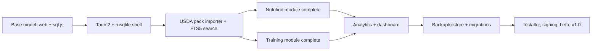

# hypertroph+

Offline-first desktop app for **nutrition tracking + hypertrophy-focused resistance training**.

This repository currently contains the **base model**: a runnable, tested foundation used to
validate direction before committing to the full desktop (Tauri/Rust) build. It implements the
real data model, the integrity guarantees, and the core UX flows.

> New here? **[`GETTING_STARTED.md`](./GETTING_STARTED.md)** has the current status and how to
> run every target (web, Windows desktop, Android/iOS) plus backup and release steps.

## Status

| Area | State |
|---|---|
| SQLite schema v1 (foods, nutrients, snapshots, exercises, workouts, sets, PRs) | Done |
| Fixed-point nutrient math + snapshot-on-log + unknown ≠ zero | Done |
| Hypertrophy metrics (weekly working-set volume, e1RM, PR detection, volume load) | Done |
| Repository / data-port abstraction (swappable to Tauri/rusqlite) | Done |
| Nutrition loop: search → log → diary → daily totals | Done |
| Training loop: start workout → add exercise → log sets → PR → finish | Done |
| Dashboard, progress (weekly volume), settings (units/targets) | Done |
| Command palette + keyboard flow | Done |
| Native shells: desktop (Electron, auto-update) + mobile (Capacitor) | Done |
| FTS5 search, packaged data packs | **Not yet** (planned) |

## Run it

```powershell
npm.cmd install
npm.cmd run dev      # dev server
npm.cmd run build    # typecheck + production build
npm.cmd run test     # 66 unit + integration tests
```

> On this machine the PowerShell `npm` shim is blocked by execution policy; use `npm.cmd`
> (or run the binaries under `node_modules\.bin\`).

## Mobile (Android & iOS)

The same app runs on Android and iOS as a fully offline native build via **Capacitor**
(see [`MOBILE.md`](./MOBILE.md)). The tracking logic, schema, calculations and UI are
unchanged; only the on-device store (a real SQLite file instead of `localStorage`) and
backup/restore are native additions. No backend, no account, no network.

```bash
npm run cap:sync          # build web bundle + copy into android/ and ios/
npm run mobile:android    # open the Android project (needs Android Studio/SDK)
npm run mobile:ios        # open the iOS project (needs macOS/Xcode)
```

## Desktop (Windows)

The same app ships as a native Windows desktop app via **Electron**
(see [`DESKTOP.md`](./DESKTOP.md)). It loads the identical web bundle, stores the
database in a real file (`%APPDATA%\hypertroph+\hypertroph.db`) with atomic
writes, and **auto-updates already-installed copies** from GitHub Releases
(`electron-updater`): updates download in the background and install on quit,
with a manual *Check for updates* button in Settings.

```bash
npm run desktop:start     # build + launch the app (dev)
npm run desktop:dist      # build an installer into ./release (no publish)
npm run desktop:release   # build + publish to GitHub Releases (needs GH_TOKEN)
```

## Data & licensing

hypertroph+ ships as an offline, redistributable product with **no paid licences**. The
full provenance register is [`DATA_LICENSES.md`](./DATA_LICENSES.md).

- **Bundled:** USDA FoodData Central (CC0 1.0, public domain) as
  `public/hypertroph-ref.sqlite.gz` (13,588 foods, searched at runtime), Free Exercise DB
  (The Unlicense, public domain) as `db/exercises.sql` (876 exercises), plus app-authored
  data. Attribution is in [`public/ATTRIBUTION.txt`](./public/ATTRIBUTION.txt).
- **Excluded entirely (not supported, not importable):** ICMR-NIN IFCT 2017 / RDA, and
  FSANZ AUSNUT / AFCD / NUTTAB — copyrighted; no loaders, no templates, no code path.

`npm run data:compliance` (also run automatically by `npm run build`) fails the build if a
source is unknown, a bundled asset is not approved, or any restricted data is tracked by
git or present in `dist/`.

## What the base model proves

1. **The schema works** against a real SQLite engine (`sql.js` WASM), including seeding,
   indexing, and the logging transaction.
2. **The integrity rules hold** (enforced by tests): nutrient values are frozen on log; editing
   a source food never rewrites history; unknown nutrients are `NULL`/`—`, never counted as 0;
   recipe and daily totals are integer-safe.
3. **The UX direction is concrete**: command-palette logging, a rest timer, PR flags, and a
   weekly-volume view.
4. **The Tauri seam exists**: all UI talks to the `DataPort` interface. The web build uses
   `sql.js` + localStorage; the desktop build will provide a `TauriRepository` over `rusqlite`
   without changing the UI or domain layer.

## Architecture (base model)

```
src/domain/*        pure TypeScript: fixed-point nutrition + hypertrophy metrics   (unit-tested)
src/data/db.ts      SQL injection point: loads schema+seed, persistence            (swap for rusqlite)
src/data/repository.ts  DataPort interface + SqliteRepository                       (integration-tested)
src/ui/*            React: App, CommandPalette                                      (talks only to DataPort)
db/schema.sql       schema v1 (34 tables/indexes)
db/seed.sql         small curated foods + exercises with provenance
```

## Roadmap from here (from the plan docs in `..\hypertrophy-app-plan`)



**Where it should head (recommendation):**
1. Wrap this exact UI/domain in **Tauri 2** so data lands in a real on-device SQLite file
   (privacy + backup + no browser storage limits). This is the smallest, highest-value step.
2. Replace the `search_key LIKE` search with **FTS5** (already in the plan) once the pack grows.
3. Build the **USDA pack importer** (CC0) next — it unlocks real coverage with zero licensing risk.
4. Then finish recipes, measurements, and backup/restore to hit the MVP exit criteria.

## Explore these decisions while it's small

- **Logging speed:** is Ctrl-K → type → Enter actually <20 s? Use it for a day.
- **Unknown ≠ zero UX:** does the "partial data" flag communicate clearly, or confuse?
- **Volume definition:** is 0.5× for secondary muscles the right default for you?
- **Units:** does gram-canonical storage with kg/lb display feel right in the gym?
- **Scope:** which of these are truly MVP — recipes, measurements, charts?

## Not included yet

Rust/Tauri shell, installers, FTS5, real data packs, recipes UI, body measurements,
backup/restore, localization files, and barcode/branded lookups. See the plan docs for the
full sequence, epics, and timeline.
